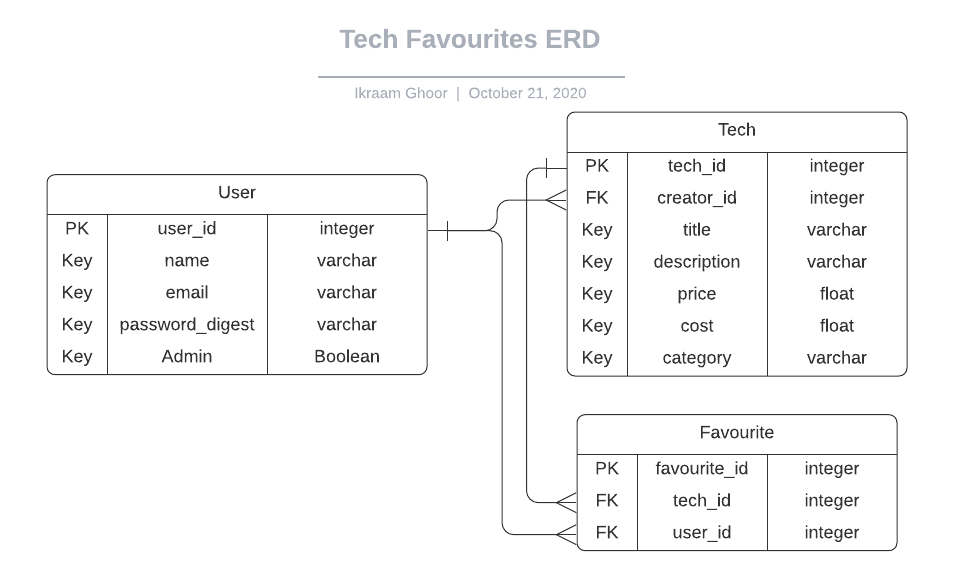

[![Contributors][contributors-shield]][contributors-url][![Forks][forks-shield]][forks-url][![Stargazers][stars-shield]][stars-url][![Issues][issues-shield]][issues-url]
[](mailto:consult.ikraam@gmail.com) [](https://twitter.com/GhoorIkraam)

# Tech Favourites
<!-- PROJECT LOGO -->

<br />
<p align="center">
  <a href="https://github.com/ikraamg/techStore.git">
    <p align="center"> 
    </p>
  </a>

  <h3 align="center">Tech favourites - Full-Stack Rails and React APP </h3>

  <p align="center">
    <a href="https://github.com/ikraamg/laptech/issues">Report a Bug or Request a Feature</a>
    ·
    <a href="https://tech-favourites.herokuapp.com/home">Live Demo</a>
  </p>
</p>

<!-- Live Link  -->

### [Live Demo Link](https://tech-favourites.herokuapp.com/home)

<br>
<!-- ABOUT THE PROJECT -->

## About The Project

This is a mobile-first full-stack app, [the front end](https://github.com/ikraamg/laptech) is a single page app that is built in React/Redux that communicates with the Ruby on Rails back-end via API requests that are secured by JWT authentication.

This repo contains the Rails back-end which function in API only mode. It handles authentication via JWT tokens and requires a token for all private requests.

The front-end can be found [here](https://github.com/ikraamg/techStore)

<!-- CONTROL'S -->
## Built With

- Rails
- RSpec
- JWT

## How to use

- Users can register and login to the account
- Users can view list of technology items and click to view full details.
- Users can favourite items and view a list of favourites

## API

Local Base URL is the url of the rails server, usually <http://localhost:3000>
The deployed base Url: <https://tech-store-rails.herokuapp.com>

You can run all the commands in postman, the base url needs to be altered for the requests when needed:
[](https://app.getpostman.com/run-collection/864ada94eaa937d45450)

### [Link to full API docs](./doc/API.md)

## ERD for Rails database

<p align="center">
  <a href="./doc/Techy.png"> 
  </a>
</p>

### Installation

To run the app locally, clone the repository and navigate to it's directory:

```bash
https://github.com/ikraamg/laptech.git
cd laptech
git checkout api-feature
bundle install
rails db:create
rails db:migrate
rails db:seed
rails s
```

Now go to [localhost:3000](http://localhost:3000) in your browser.

### Automated Testing 🧪

The app was test with rspec and factoryBot and shoulda-matchers.

```bash
rspec
```

## "Nice To Have Requirements" that are implemented

- Implemented proper user authentication from the front-end to the server
- Created a user table in the database, so that a given user can only access the favourites they selected
- Made the app responsive, creating both tablet and desktop versions, following design guidelines
- Transitions were implemented to make the user experience better
- Created full documentation for the API
- Dark Mode via toggle

## Potential Updates

- Users can message the creator of a tech-favourite
- A store like checkout system can be created

<!-- CONTACT -->

## Authors

👤 **Ikraam Ghoor**

- Github: [@ikraamg](https://github.com/ikraamg)
- Twitter: [@GhoorIkraam](https://twitter.com/GhoorIkraam)
- LinkedIn: [isghoor](https://linkedin.com/isghoor)
- Email: [consult.ikraam@gmail.com](mailto:consult.ikraam@gmail.com)

## Show your support

Give a ⭐️ if you like this project!

## Acknowledgments

Design influenced by [Alexey Savitskiy on Behance](https://www.behance.net/alexey_savitskiy)

<!-- MARKDOWN LINKS & IMAGES -->
<!-- https://www.markdownguide.org/basic-syntax/#reference-style-links -->

[contributors-shield]: https://img.shields.io/github/contributors/ikraamg/laptech.svg?style=flat-square
[contributors-url]: https://github.com/ikraamg/laptech/graphs/contributors
[forks-shield]: https://img.shields.io/github/forks/ikraamg/laptech.svg?style=flat-square
[forks-url]: https://github.com/ikraamg/laptech/network/members
[stars-shield]: https://img.shields.io/github/stars/ikraamg/laptech.svg?style=flat-square
[stars-url]: https://github.com/ikraamg/laptech/stargazers
[issues-shield]: https://img.shields.io/github/issues/ikraamg/laptech.svg?style=flat-square
[issues-url]: https://github.com/ikraamg/laptech/issues

## 📝 License

This project is [MIT](https://opensource.org/licenses/MIT) licensed.
